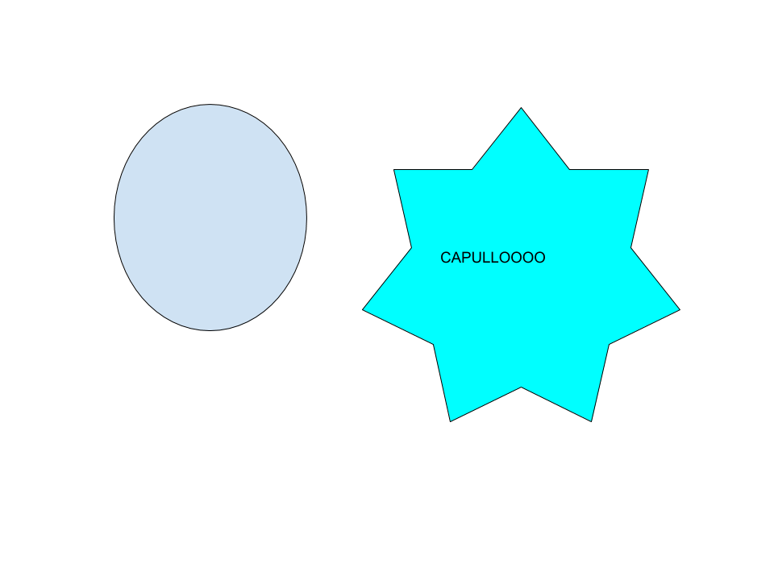

***
# ***OilMeter***
***
## **Parte 1** (Origen del proyecto)

En mi casa, no tenemos un **medidor del nivel de gasóleo.** Esto es una molestia porque hay que ir a medir el gasóleo de forma manual, cada poco tiempo. Como todavía soy un amateur en programación y robótica, a mi padre se le ha ocurrido que haga un proyecto de **programación y robótica**, basado en crear un medidor del nivel del gasóleo, **programado en go**, un lenguaje de programación que estoy aprendiendo en **"go tutorial"**. También utilizaremos una **raspberry** como **hardware**.
***
## **Parte 2** (Descripción breve del proyecto)

Este repositorio contiene las instrucciones y el código para construir un medidor del nivel de un tanque de gasóleo.

El siguiente dibujo muestra la arquitectura del sistema:

